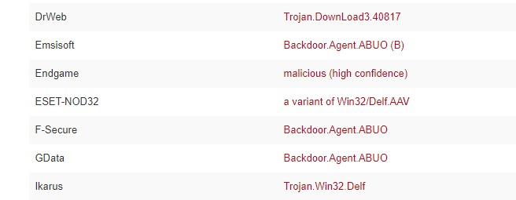
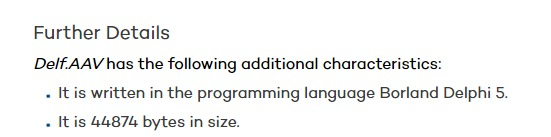
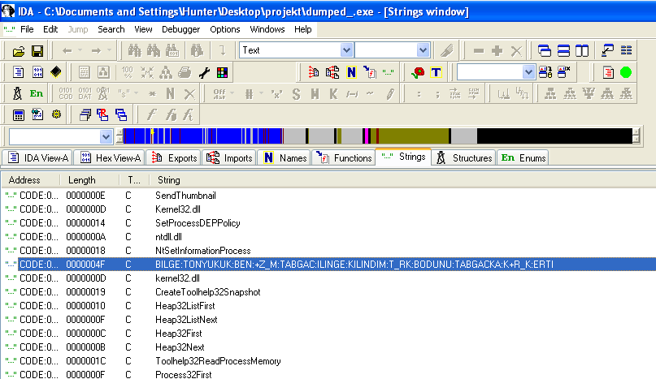
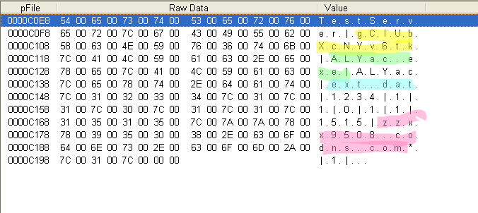
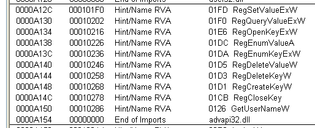
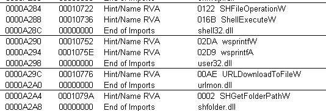
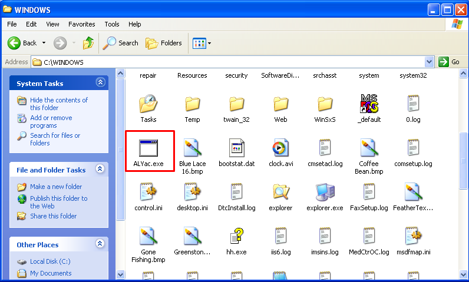
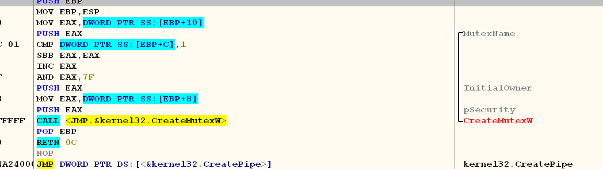
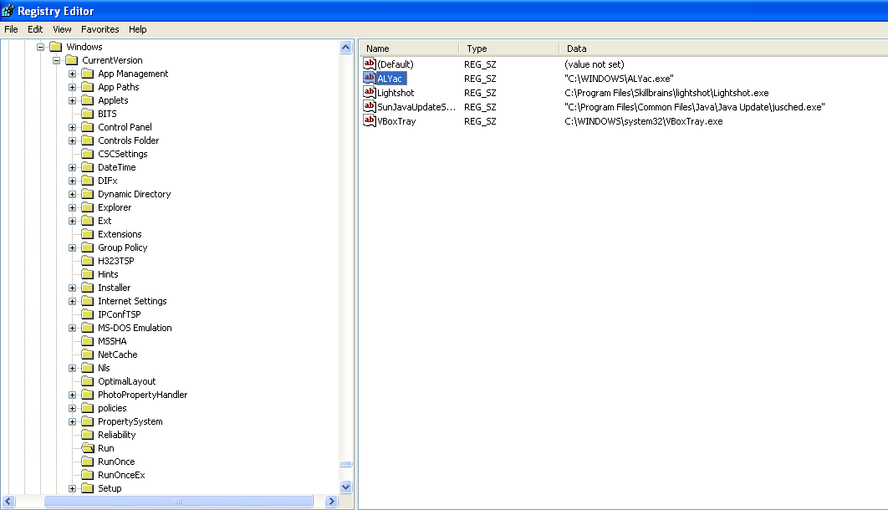

---
title:
- fd68b65b661e34f3c1b09f2c5f8b1cd64ad42432
author:
- Anita Božić, Maja Krmpotić Đurđević, Filip Sodić
theme:
- metropolis
---

# Pregled

## Pregled

1. Raspakiravanje programa
2. Statička analiza programa
3. Dinamička analiza programa

# Sloj za pakiranje

## Detalji pakera

Radi se o običnom pakeru:

---------------         	 -------    
**Ime:**                      PE-Pack
**Autor:**                    ANAKiN  
**Verzija:**                  1.0     
**Godina proizvodnje:**       1998    
---------------         	 -------

Informacije o pakeru:  

- Potpis u sekciji
- [Vlastita dokumentacija](https://cheaters-heaven.com/games/tools/33175-pe-pack-v1-0.html)
- [Indeks pakera i sličnih alata](https://www.exetools.com/old-page/encrypt.htm)
- [Upute za rukovanje raznim pakerima](https://www.virusbulletin.com/virusbulletin/2012/07/quick-reference-manual-unpacking-ii)

## Zanimljivosti
 - Netipična imena sekcija
 - Paker ne skriva da je paker
 - Potpis autora

## Sekcije

## Potpis

## Tijek rada

Tijek rada pakera:

- Paker vrši dekompresiju (nema dekripcije)
- Sažeti su podaci spremljeni u sekciji `CODE`
- Alocira se prostor na koji se oni kopiraju
- Podaci se zatim zapisuju u prazan dio `CODE` sekcije 

## Detalji implementacije

- Jedan sloj (ako se racunaju samo alokacije koda koji se izvršava)
- paker ne radi dinamičko učitavanje importa
- Skok na entry point ostvaren je naredbom `JMP EAX`, u registru `EAX` pohranjena je adresa ulazne točke
- custom algoritam

## Tablice import funkcija pakera

## Tablice import funckija pakera

## Skok na ulaznu točku

# Statička anliza

## Statička analiza

- Sumnjiva imena sekcija
- Evidentno da je zapakiran
- Implementiran u Delphiju
- Sumnjiva turska imena u kodu
- API za sumjive postupke (stvaranje datoteka, funkcije za modifikaciju registra)

## Deplhi (1)

## Deplhi (2)

## Turci 

## Config sekcija 

## Sumnjiv API (1)

## Sumnjiv API (2)

# Dinamička analiza

## Kategorizacija prema funkcionalnosti

- Povezivanje na internet
- Udaljen pristup zaraženom računalu (Trojan, Backdoor)

## Povezivanje na internet

- U petlji se pokušava pristupiti adresi zzxx9508.codns.com, međutim zbog načina rada bez pristupa mreži konekcija se nikad ne ostvari
	- `WSAECONNREFUSED`
	- Pokušava napadaču poslati podatke o zaraženom računalu (hostname: `jane_f2070126d8`)
	- Podaci se šalju protokolom `HTTP`

## Rad s datotekama

- Pokušava stvoriti ext.dat datoteku
- Stvara `ALYac.exe`e datoteke u `C:\Windows\`

## Rad s datotekama

## Vlastita prevencija reinfekcije
- Pri prvom pokretanju stvara monitor
- Pri svakom pokretanju provjerava postoji li monitor (ako već postoji, neće doći do infekcije)

## Vlastita prevencija reinfekcije : monitor

## Perzistencija
- Spomenuti monitor
- Spomenute stvorene datoteke
- Mijenjanje registra radi prevencije brisanja stvorenih datoteka: 
	- `HKEY_LOCAL_MACHINE`
	- `Software\Microsoft\Windows\CurrentVersion\Run`
	- `C:\Windows\ALYac.exe`

## Promjene u registru

# Prevencija infekcije

## Detekcija i prevencija infekcije

Samostalno:

- Analiza stringova
- Statička analiza sekcija

Pomoću drugih programa:

- Kongruentno ga otkrivaju svi antivirusi
- Provjera datoteke na internetu
- Provjera hasha na internetu

## Detekcija nakon infekcije

- Promjene u registru (monitor i zabrane pristupa datoteci)
- Stvorene datoteke
- Ne možemo brisati sumnjive datoteke

