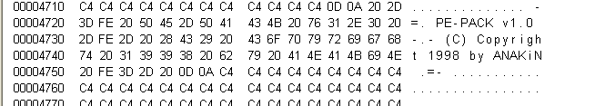

---
title:
- Raspakiravanje, statička i dinamička analiza zločudnog programa
author:
- Anita Božić, Maja Krmpotić Đurđević, Filip Sodić
theme:
- Copenhagen
---

# Pregled

## Pregled

1. Raspakiravanje programa
2. Statička analiza programa
3. Dinamička analiza programa

# Sloj za pakiranje

## Detalji packera

Radi se o običnom packeru:

---------------         	 -------    
**Ime:**                      PE-Pack 
**Autor:**                    ANAKiN  
**Verzija:**                  1.0     
**Godina proizvodnje:**       1998    
---------------         	 -------

Informacije o packeru:  

- Potpis u sekciji
- [Vlastita dokumentacija](https://cheaters-heaven.com/games/tools/33175-pe-pack-v1-0.html)
- [Indeks packera i sličnih alata](https://www.exetools.com/old-page/encrypt.htm)
- [Upute za rukovanje raznim packerima](https://www.virusbulletin.com/virusbulletin/2012/07/quick-reference-manual-unpacking-ii)

## Zanimljivosti
 - netipična imena sekcija
 - packer ne skriva da je packer
 - potpis autora

## Sekcije

## Potpis

## Detalji implementacije

- Mislim da ima više slojeva (prvo je nešto mijenjao, pa onda opet isto to)
- Packer radi dinamičko učitavanje importa

## Tablice import funkcija packera

## Tablice import funckija packera

## Detalji implementacije

- Mislim da ima više slojeva (prvo je nešto mijenjao, pa onda opet isto to)
- Packer radi dinamičko učitavanje importa
- skok na entry point ostvaren je naredbom `JMP EAX`, u registru `EAX` pohranjena je adresa ulazne točke

## Detalji implementacije

## Detalji implementacije

- Mislim da ima više slojeva (prvo je nešto mijenjao, pa onda opet isto to)
- Packer radi dinamičko učitavanje importa
- skok na entry point ostvaren je naredbom `JMP EAX`, u registru `EAX` pohranjena je adresa ulazne točke
- koji se algoritam koristi nisam skuzio jos

# Section 2
Ovo je druga sekcija:

+ jos jedan item
+ jos jedan item

## Podsekcija